# Pearl Match - Complete Flow Diagrams

## 1. Authentication & User Account Flow

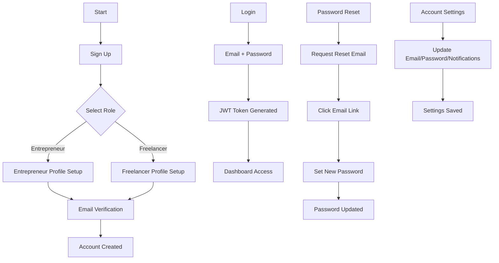

## 2. Entrepreneur Profile Creation Flow

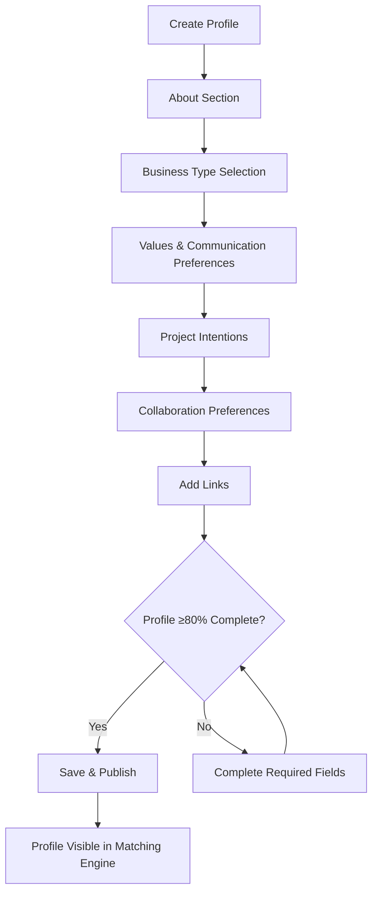

## 3. Freelancer Profile Creation Flow

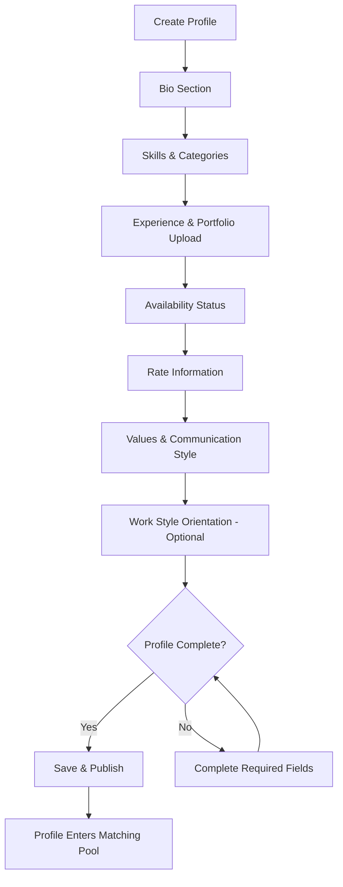

## 4. Mission Creation Flow (Entrepreneur)

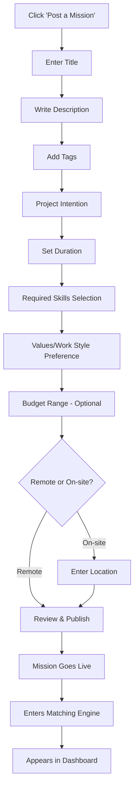

## 5. Intelligent Matching Engine Flow

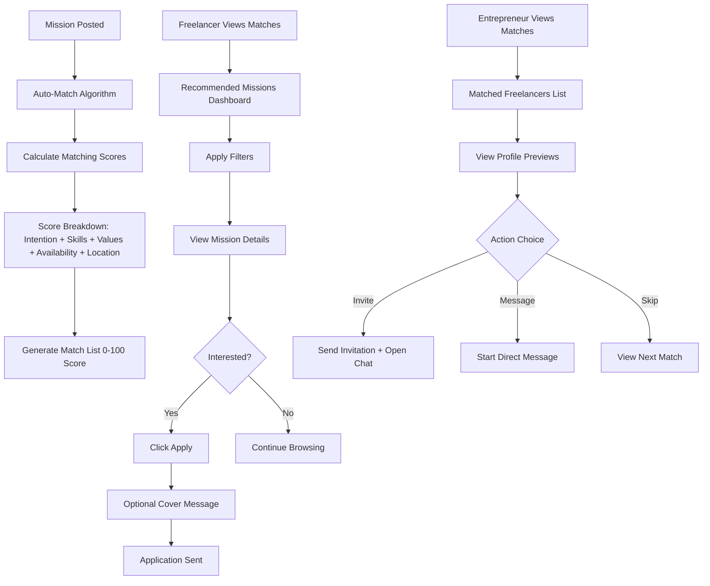

## 6. Messaging System Flow

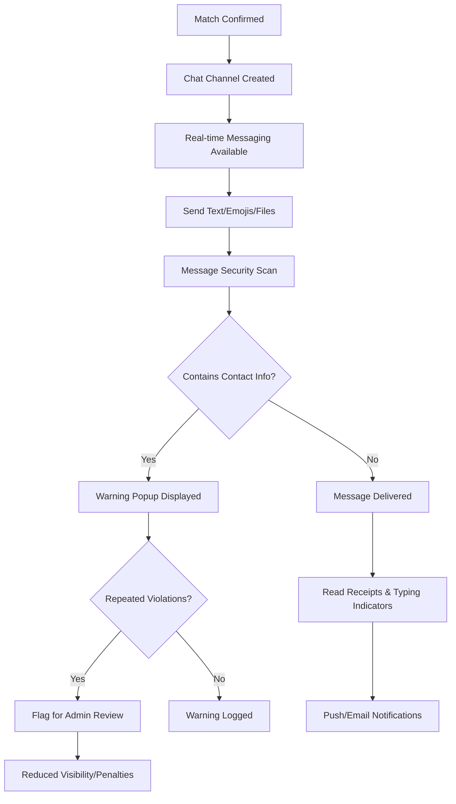

## 7. Freelancer Dashboard Flow

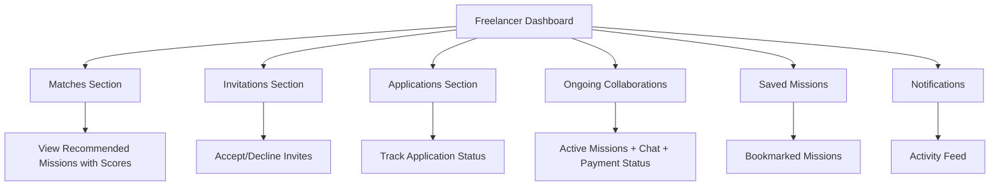

## 8. Entrepreneur Dashboard Flow

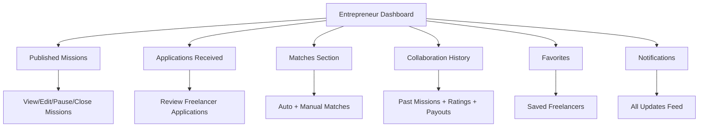

## 9. Payment System Flow

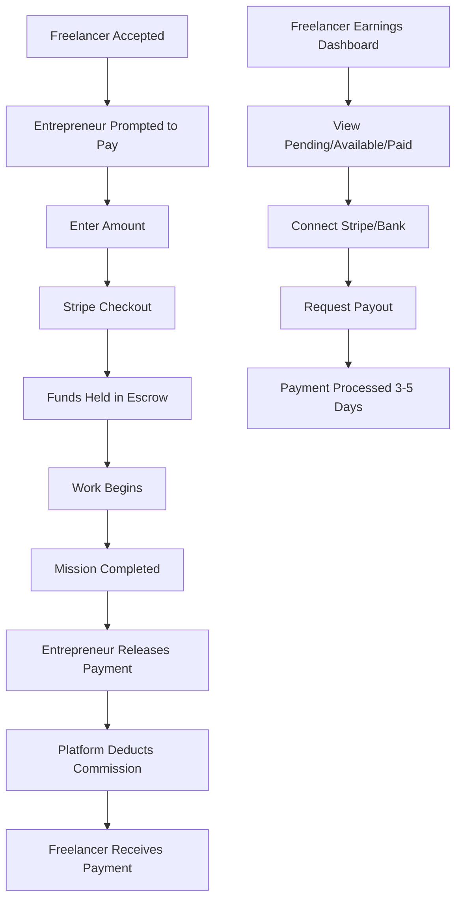

## 10. Admin Dashboard Flow

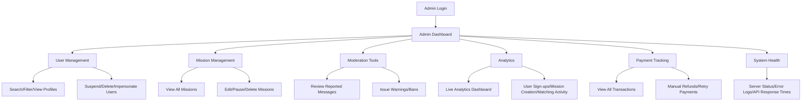

## 11. Security & Anti-Leak System Flow

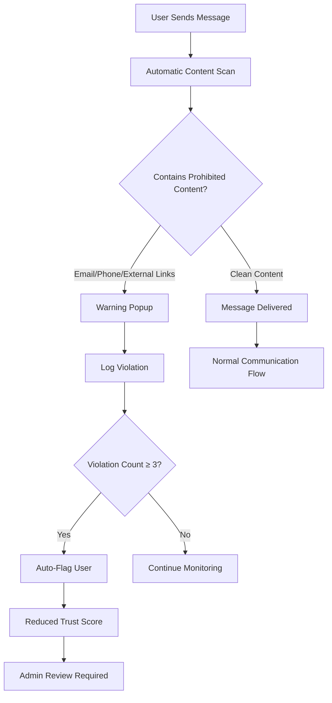

## 12. Complete User Journey Flow

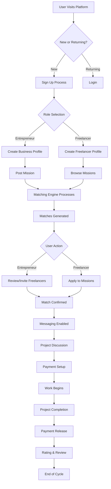

## 13. Role Permission Matrix Flow

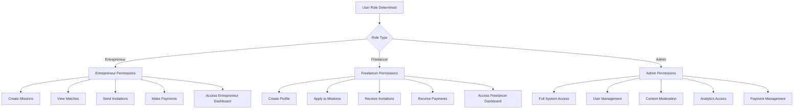